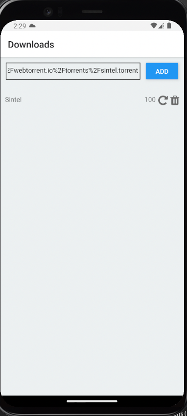
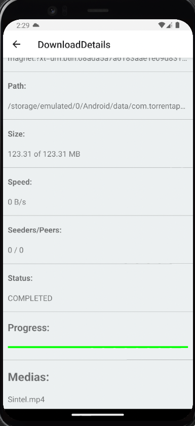
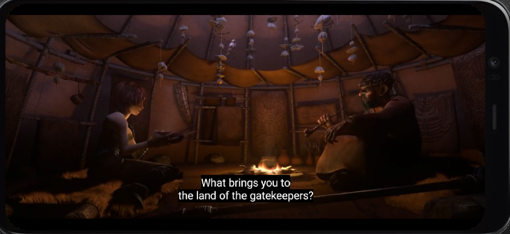

# Torrent App

Simple BitTorrent Android app client for download files from torrent network.

**Status:** In development (maybe never will be finished, this is only a hobby project of a curious developer about practical working of torrent technology)

## Introduction

This project is a BitTorrent client for Android. The main goal is to provide a simple and easy to use application to download files from torrent network. The application is based on [React Native](https://facebook.github.io/react-native/) and extended with native module for torrent downloading written in Java powered by [jlibtorrent](https://github.com/frostwire/frostwire-jlibtorrent).

## Features

| Feature          | Description                                           | Status                                    |
| ---------------- | ----------------------------------------------------- | ----------------------------------------- |
| Download torrent | Download resources using magnet links                 | Done                                      |
| View videos      | View videos included srt subtitles present in torrent | Done (mp4), Planned (mkv, mov, avi, webm) |
| Listen audios    | Listen audio files                                    | Planned (mp3)                             |
| View images      | Planning View jpg images                              | Planned (jpg, png)                        |
| Install apps     | Install apps included in torrent                      | Planned (apk)                             |
| Streaming        | Stream medias while downloading                       | Planned                                   |

## Screenshots

### Home Page - Download list



### Download Details



### Video Player



## Requirements

- [Java 8](http://www.oracle.com/technetwork/java/javase/downloads/jdk8-downloads-2133151.html)
- [Node.js](https://nodejs.org/en/download/)
- [Yarn](https://yarnpkg.com/en/docs/install)

## Install dependencies

```bash
yarn install
```

## Run

Requirements:

- Android device connected to the computer or emulator running. For more information about how to setup a android emulator, please, read the [React Native - Setting up the development environment](https://reactnative.dev/docs/0.66/environment-setup).

The are many ways to run the application. Bellow are the most common ways.

### Run application

In this mode the application will be compiled and installed in the device.

```bash
yarn android-run
```

### Run application in debug mode

In this mode, the application will be run in a development server and the application will be reloaded every time you change the code. Therefore, is necessary to keeps the terminal open.

```bash
yarn android-run-debug
```

## Build application

The instructions bellow only works in Linux and Mac OS X systems. If you are using Windows, please, read the [official documentation](https://facebook.github.io/react-native/docs/getting-started.html) to run the application.

```bash
yarn android-build
```

After prosseccing the command above, the apk file will be generated in `android/app/build/outputs/apk/release/app-release.apk`.
